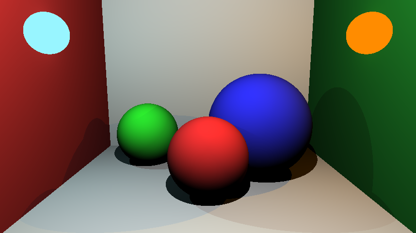

# Ray Tracing Engine (2019)

A 3D ray tracing renderer implemented in Rust, featuring a hierarchical scene graph, multiple primitive types, and realistic lighting calculations.



## Features

- **Hierarchical Scene Graph**: Node-based architecture with 3D transformations
- **Primitive Support**: Spheres and planes with customizable materials
- **Lighting System**: Multiple light types including spherical and directional lights
- **Ray-Object Intersection**: Efficient intersection testing with surface normal calculation
- **Shadow Rendering**: Realistic shadow casting with occlusion testing
- **Color Management**: RGB color system with proper clamping and blending

## Architecture

### Core Components

- **Node System**: Abstract node interface with concrete implementations for 3D objects
- **Scene Management**: Hierarchical scene organization with world/local transforms
- **Camera System**: Configurable camera with field of view and resolution settings
- **Render Pipeline**: Multi-threaded rendering with ray casting and shading

### Supported Primitives

- **Spheres**: Configurable radius and position
- **Planes**: Infinite planes with normal-based orientation
- **Lights**: Point lights with intensity falloff and color

## Building and Running

### Prerequisites

- Rust 1.31+ (2018 edition)
- Cargo package manager

### Dependencies

```toml
[dependencies]
image = "0.12.3"
cgmath = "0.16.1"
```

### Build

```bash
cargo build --release
```

### Run

```bash
cargo run
```

The rendered image will be saved as `output.png` in the project root.

## Usage Example

```rust
// Create camera
let camera = CameraNode::new(
    "main_camera".to_string(),
    Matrix4::from_translation(Vector3::new(0.0, 0.0, 0.0)),
    Vector3::new(0.0, 0.0, -1.0),
    858, 480
);

// Create scene with colored spheres
let sphere = SphereNode::new(
    "Red Sphere".to_string(),
    Matrix4::from_translation(Vector3::new(0.0, -3.0, -5.5)),
    1.0,
    Color::new_rgb(255, 51, 51)
);

// Add lighting
let light = Light::Spherical(SphericalLight::new(
    "Main Light".to_string(),
    Matrix4::from_translation(Vector3::new(0.0, 3.0, -1.0)),
    Color::new_rgb(255, 255, 255),
    80.0
));

// Render scene
let renderer = RenderSystem { output_path: "output.png".to_string() };
renderer.render(&scene, camera);
```

## Technical Details

- **Ray Generation**: Primary rays generated using perspective projection
- **Intersection Testing**: Analytical solutions for sphere and plane intersections
- **Shading Model**: Lambertian diffuse shading with shadow testing
- **Transform Hierarchy**: Matrix-based transformations with parent-child relationships
- **Memory Management**: Reference counting with interior mutability for scene graph

## Output

The renderer generates PNG images with configurable resolution. The example scene creates a Cornell box-style setup with colored walls and multiple spheres under realistic lighting conditions.

## Author

Sebastian Preuß (sebastian.ted.preuss@gmail.com)